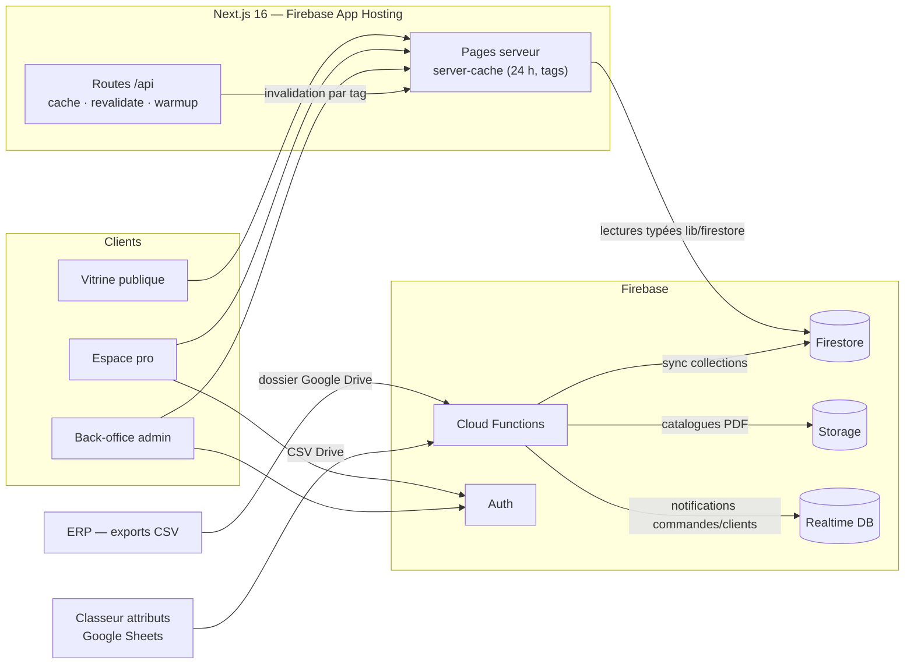
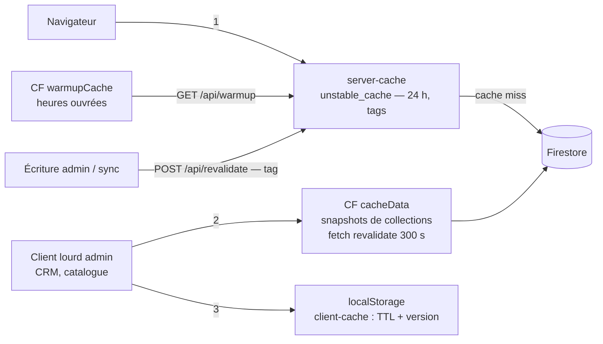

# Architecture — Surprisez-Vous

Vue d'ensemble technique du site. Complète le [README](../README.md), qui couvre l'installation et les commandes.

**En chiffres** : 43 pages (App Router) · 45 composants · 38 modules `lib/` · 24 Cloud Functions (~1 900 lignes) · ~24 collections Firestore · 47 tests unitaires · 5 suites e2e.

## Vue d'ensemble

Le front est une application Next.js (App Router) déployée sur **Firebase App Hosting**. Toutes les données vivent dans **Firestore**, alimenté de deux côtés : le back-office (saisie directe) et des **Cloud Functions de synchronisation** qui ingèrent les exports CSV de l'ERP et du classeur d'attributs, déposés sur Google Drive. La **Realtime Database** ne sert qu'aux notifications temps réel (cloche admin et client). Le site ne parle jamais à l'ERP : Drive est le sas d'échange.

## Zones de l'application

### Vitrine — `app/(public)/` (18 pages)

Accueil (hero immersif, sections produits/univers/Instagram), **catalogue par categorie** (`/catalogue`, navigation par attributs), **fiche produit** (`/produit/[slug]`, rendu serveur dynamique), `/univers`, `/showroom` (expérience three.js), `/revendeur` (carte des points de vente, rendu dynamique), espace-pro marketing et tunnel d'inscription pro (reCAPTCHA v3), connexion, pages légales et plan du site.

### Espace pro — `app/pro/` (9 pages, authentifié)

Catalogue avec tarifs négociés, panier et confirmation, commande express, dashboard, espace client (commandes, contacts, infos). Le panier vit dans `cart-context` ; les prix passent par `useTarif` qui résout la grille tarifaire du client connecté.

### Back-office — `app/admin/` (16 pages, claim admin)

| Page | Rôle |
|---|---|
| `catalogue`, `catalogues` | Produits, déclinaisons, attributs · PDF catalogues |
| `crm`, `revendeurs`, `groupes-contact` | Clients (~3 800 fiches via la CF de cache), revendeurs, groupes de diffusion |
| `commandes`, `tarifs` | Suivi des commandes, grilles tarifaires |
| `editeur`, `personnalisation` | Édition en place de la vitrine (iframe + `components/editable/`) |
| `marketing`, `statistiques`, `implantation`, `repartition` | Campagnes, stats, outils métier |
| `sync` | Pilotage des synchronisations ERP |

### Aperçus éditeur — `app/(editor-preview)/`

`header-preview` et `footer-preview` : rendus isolés affichés en iframe par `/admin/editeur`, qui communique par `postMessage` via `iframe-edit-context`.

### API interne — `app/api/`

| Route | Rôle | Protection |
|---|---|---|
| `POST /api/revalidate` | Invalidation ISR par tag après une écriture admin ou une sync | `CACHE_SECRET` |
| `/api/cache/[collection]`, `/api/cache/patch` | Relais vers la CF `cacheData`, patchs ciblés | `CACHE_SECRET` |
| `GET /api/warmup` | Réchauffe le server-cache (appelé par la CF planifiée `warmupCache`) | — |
| `/api/e2e/delete-order` | Nettoyage des données de test Playwright | Garde e2e |

## Couche données

### Accès Firestore — `lib/firestore/`

Un module par collection, seul endroit du code qui parle à Firestore. Chaque module exporte les types TypeScript et les fonctions d'accès ; pages et composants n'importent jamais `firebase/firestore` directement. `lib/firebase.ts` initialise le SDK client (Firestore, Auth, Storage, RTDB) en singleton lazy.

Collections par domaine :

| Domaine | Collections | Alimentation |
|---|---|---|
| Catalogue | `products`, `categories`, `stat-categories`, `product-groups`, `marques`, `product-marques`, `evenements`, `catalogues` | Sync ERP + admin |
| Attributs | `attribute-registry`, `attribute-values`, `product-attributes` | Classeur Sheets via `syncAttributs` |
| Commerce | `orders`, `commandes` (historique ERP), `tarifs` + sous-collection `lignes`, `clients`, `pro-requests`, `users` | Site (orders) + sync ERP |
| Contenu & vitrine | `contenu-pages`, `page-content`, `settings`, `marketing`, `groupes-contact` | Back-office |

### Référentiel d'attributs et déclinaisons

Le classeur Google Sheets (« Sheet attribut ») est la **source de vérité métier** : trois feuilles exportées en CSV sur Drive (`SV_ATTRIBUTS`, `SV_VALEURS`, `SV_PRODUITS`), ingérées par `syncAttributs` vers les trois collections d'attributs. Côté site, `lib/attributes.ts` charge le référentiel, `lib/declinaisons.ts` regroupe les produits en déclinaisons (couleur, taille…) affichées sur la fiche produit et le catalogue par categorie. La jointure se fait sur `ref` (classeur) ↔ `pdt_reference` (ERP).

### Notifications — `lib/rtdb/`

`notifications.ts` (admin : `new_order`, `new_client`) et `client-notifications.ts` (pro : suivi de statut de commande). Écrites par les triggers Cloud Functions, consommées en `onValue` par les cloches `AdminNotifBell` / `ProNotificationBell`.

### Mode local — zéro lecture facturée

`SV_LOCAL_DATA=1` fait lire à toute la couche `lib/firestore/` des fixtures JSON dans `.local-data/` (via `lib/local-data.ts`, mémo invalidé sur la date du fichier). Fixtures produites par `npm run local:data` (snapshot Firestore réel) ou `-- --demo` (jeu de démo hors ligne). Permet de développer et de démontrer le site sans consommer de quota.

## Stratégie de cache

Trois niveaux, pensés pour qu'une visite publique ne coûte (presque) aucune lecture Firestore :

1. **Serveur** — `lib/server-cache.ts` : chaque famille de données est enveloppée dans `unstable_cache` (revalidation 24 h, invalidation ciblée par tag via `POST /api/revalidate`). C'est lui qui sert la vitrine.
2. **Cloud Function `cacheData`** — endpoint HTTP qui sert des snapshots de collections entières aux écrans lourds du back-office (CRM ~3 800 clients) ; réchauffé par la planifiée `warmupCache` aux heures ouvrées.
3. **Navigateur** — `lib/client-cache.ts` (localStorage, TTL + numéro de version pour invalider en masse) et `lib/admin-cache.ts` pour le back-office.

## Cloud Functions — `functions/index.js`

| Famille | Fonctions | Déclencheur | Rôle |
|---|---|---|---|
| Sync ERP | `syncArticles`, `syncTarifs`, `syncClients`, `syncCommandes`, `syncColisage`, `syncStatCategories`, `syncAttributs`, `syncDossierCsv` | HTTP (+ `syncQuotidien` planifiée) | CSV Drive → Firestore, avec diff (n'écrit que ce qui change) |
| Catalogues PDF | `syncCatalogues`, `syncCataloguesMeta`, `syncClientCatalogues`, `syncOneCatalogue`, `listCatalogueFiles` | HTTP | Drive → Storage + métadonnées Firestore |
| Planifiées | `syncQuotidien`, `warmupCache`, `autoRefreshInstagramToken` | Cron | Sync journalière · réchauffage cache · renouvellement token Instagram (mensuel) |
| Triggers Firestore | `sendOrderEmail` (`orders` create), `onOrderStatusChange` (`orders` update), `setAdminClaim` (`users` write) | Firestore | E-mail de commande · notification RTDB client · custom claim admin |
| HTTP divers | `cacheData`, `instagramFeed`, `verifierRuptures` | HTTP | Cache de collections · flux Instagram de la home · contrôle de ruptures |

## Authentification & sécurité

- **Firebase Auth** pour les clients pro et les admins. Le rôle admin est un **custom claim** posé par `setAdminClaim` à l'écriture de `users/{uid}` — les règles Firestore et les layouts (`app/admin/layout.tsx`) s'appuient dessus.
- **Règles versionnées** à la racine : `firestore.rules` (lecture publique du catalogue, écritures réservées admin, données clients cloisonnées par `uid`), `storage.rules`, `database.rules.json`.
- Inscription pro derrière **reCAPTCHA v3** ; demandes stockées dans `pro-requests` avant validation admin.
- `/api/cache/*` et `/api/revalidate` exigent le secret partagé `CACHE_SECRET` (défini côté App Hosting et Functions).
- Extension Firebase **`delete-user-data`** : purge automatique des données à la suppression d'un compte.

## Contenu éditable & contextes React

L'admin peut éditer la vitrine **en place** : `edit-mode-context` active le mode édition, les composants `components/editable/` (`EditableText`, `EditableImage`, `EditableBlock`, `EditableLink`) deviennent cliquables et persistent dans `contenu-pages` / `page-content` / `settings`. L'éditeur `/admin/editeur` affiche les previews en iframe et dialogue par `postMessage` (`iframe-edit-context`).

Autres contextes : `auth-context` (session, rôle), `cart-context` (panier pro), `site-theme-context` (thème et réglages de la vitrine). Hooks notables : `useTarif` (résolution de la grille tarifaire du client), `useCart`, `useAnime` (anime.js).

## Tests

- **Unitaires / composants** — Vitest + Testing Library (`__tests__/`, jsdom, mocks Firebase dans `__mocks__/`) : 47 tests, 5 fichiers.
- **E2E** — Playwright (`e2e/` : `public/`, `pro/`, `admin/`, `auth/`), exécutables contre l'**émulateur Firebase** (`npm run test:e2e:emulator`, garde anti-prod).
- Cahier de test manuel : [CAHIER-DE-TEST.md](CAHIER-DE-TEST.md).

## Déploiement

| Cible | Mécanisme |
|---|---|
| Site Next.js | **Firebase App Hosting** — build au push, `apphosting.yaml` (1 CPU / 512 Mio, 0→4 instances, variables + secret `CACHE_SECRET`) |
| Cloud Functions | `firebase deploy --only functions` |
| Règles | `firebase deploy --only firestore:rules` · `--only storage` · `--only database` |
| Émulateurs | Auth (9099) + Firestore (8080), `firebase.json` |

Workflow git : `feature/<sujet>` → PR vers `develop` → PR `develop` → `main`.
